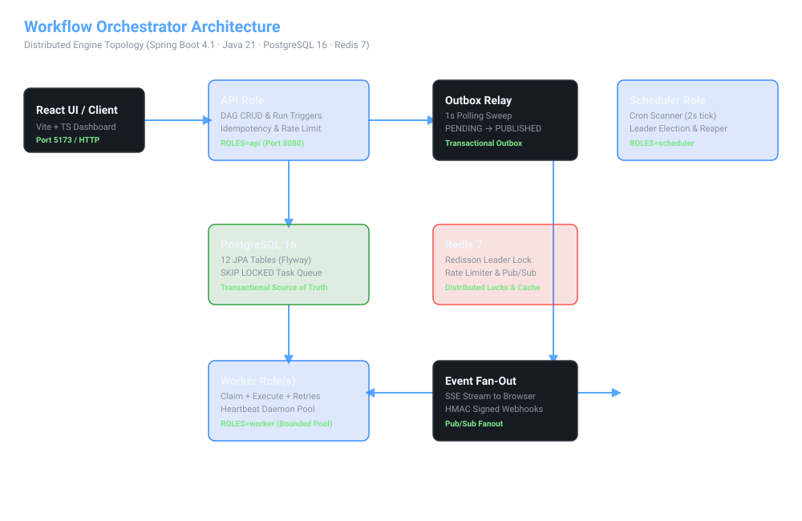
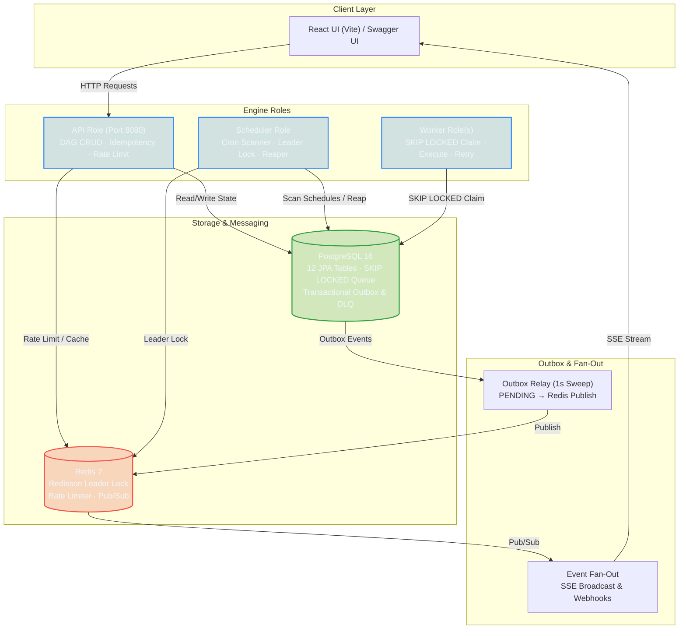

# Workflow Orchestrator — an Airflow-lite DAG engine

A production-grade distributed workflow engine. Define DAGs as YAML, trigger runs
manually or on a cron schedule, and let a distributed worker pool execute tasks with
retries (exponential backoff + jitter), a dead-letter queue with replay, an outbox-backed
live event stream (SSE + signed webhooks), idempotency, rate limiting, and crash recovery.

Built for **Build-A-Thon 2026** (Theme 1: Data & Processing Pipelines).

**Spring Boot 4.1 (Java 21) · PostgreSQL 16 · Redis 7 · React 19 · one codebase, three roles (API / scheduler / worker)**

**Live demo**: https://workflow-orchestrator-yij6.onrender.com · **[Demo video](demo-video.mp4)** (2 min, narrated)

---

## Table of contents

1. [What it does](#what-it-does)
2. [Judging-pattern map](#judging-pattern-map)
3. [Architecture](#architecture)
4. [DAG definition format (YAML / JSON)](#dag-definition-format-yaml--json)
5. [Data model](#data-model)
6. [State machines](#state-machines)
7. [Worker task execution flow](#worker-task-execution-flow)
8. [API reference](#api-reference)
9. [Configuration](#configuration)
10. [Running it](#running-it)
11. [Testing](#testing)
12. [Deploying to Render](#deploying-to-render)
13. [Failure recovery](#failure-recovery)
14. [Trade-offs & future work](#trade-offs--future-work)
15. [Project layout](#project-layout)
16. [License](#license)

---

## What it does

- **DAG definitions in YAML or JSON** — tasks, parallel branches, dependency edges, per-task retry policies, timeouts, cron schedules, and singleton-task gating.
- **Distributed execution** — workers claim the next due task with `SELECT … FOR UPDATE SKIP LOCKED`, so multiple worker instances share one queue with at-most-once execution and zero message loss.
- **Retries & dead-letter queue (DLQ)** — per-task `maxRetries` with exponential backoff + full jitter. Exhausted tasks land in a first-class DLQ with a replay API. Retry timing is stored as data (`scheduled_at`), never as in-process sleeps.
- **Cron scheduling with leader election** — a Redisson distributed lock guarantees exactly one scheduler instance scans schedules, even with multiple schedulers running (demonstrable with the second scheduler in `docker-compose`).
- **Live event stream (outbox pattern)** — every state change is written to a Postgres `outbox_event` row in the *same transaction* as the business state change. A polling relay publishes to Redis pub/sub, which fans out to an SSE endpoint (dashboard live updates) and to signed HMAC-SHA256 webhooks (third-party integrations).
- **Idempotency everywhere (three layers)**:
  1. **API-level** — an `Idempotency-Key` header dedupes mutating API calls (`POST /dags`, `POST /dags/{id}/runs`). A unique-key insert acts as the mutex; a request-hash mismatch on a duplicate key returns `422`.
  2. **DB-level** — `dag_run.idempotency_key` is `UNIQUE`, so run triggers are deduplicated at the storage layer too.
  3. **Task-level** — HTTP tasks carry an `Idempotency-Key` header of `runId:taskId:attempt`, making the external HTTP call itself retry-safe.
- **Rate limiting** — Redis-backed `RRateLimiter` (token bucket) per API key, falling back to client IP. Returns `429` with a `Retry-After` header.
- **Crash recovery** — a reaper marks tasks whose heartbeat has gone stale as `FAILED`, re-entering the retry path. Heartbeats are refreshed continuously while a task executes.
- **DAG versioning** — updating a definition bumps `dag.version` and inserts a fresh set of versioned task rows. Historical rows are retained so past runs keep their references; new runs resolve only the current version.

---

## Judging-pattern map

Every pattern the hackathon rubric calls for is a core product component, not a bolt-on:

| Pattern | Where | How |
|---|---|---|
| **Idempotency** | `api/IdempotencyFilter`, `service/RunService` | `Idempotency-Key` filter with mutex insert (`idempotency_record` PK + request-hash check → 422 on mismatch); run triggers dedupe via unique `idempotency_key`; HTTP tasks carry `runId:taskId:attempt` keys |
| **Outbox pattern** | `outbox/OutboxWriter`, `outbox/OutboxRelay` | State changes write `outbox_event` in the same DB tx; `OutboxRelay` (1 s poll) publishes to Redis pub/sub; subscribers fan out to SSE + signed webhooks |
| **Retry / dead-letter** | `worker/WorkerService`, `BackoffCalculator` | Per-task `maxRetries` + exponential backoff with full jitter; attempts recorded in `task_attempt`; exhausted → `dead_letter` table + replay API |
| **Caching** | `service/DagService`, `api/StatsController` | DAG list/definition cache in Redis with **active invalidation** on register/update/pause; stats cached for 10 s |
| **Rate limiting** | `ratelimit/RateLimitFilter` | Redisson `RRateLimiter` per API key (fallback IP), `429` + `Retry-After` |
| **Distributed locking** | `lock/LockManager`, `scheduling/LeaderElection` | Redisson `RLock` for scheduler leadership, singleton-task serialization, per-run cancellation mutexes |
| **Leader election** | `scheduling/LeaderElection` | Redisson `tryLock` with zero-wait per tick; only the leader scans cron schedules |
| **Circuit-breaker / resilience** | `scheduling/ReaperService` | Stale-heartbeat detection re-enters the retry path rather than losing work |

---

## Architecture

One Maven artifact runs as three logical roles selected by the `ROLES` env var
(`api`, `scheduler`, `worker`). `docker-compose.yml` runs them as separate processes;
a single Render instance runs all three (safe: `SKIP LOCKED` claims and Redisson locks
make colocation race-free).

[](docs/architecture.html)

> 💡 **[Open Interactive Architecture Explorer](docs/architecture.html)** — Explore live component topology, simulated task execution flow, and state machine transitions in your browser!




### Why Postgres as the queue (not Redis / Kafka)

Task claiming uses `SELECT … FOR UPDATE SKIP LOCKED` — the pattern behind real job
queues like Rescue/Sidekiq. It gives us:

- **One source of truth** — queue state and business state live in the same transaction.
- **No lost tasks** — a row is only visible to another worker if the claimer crashes before committing.
- **No double execution** — the row lock is held until the claim transaction commits.
- Redis is used where it is genuinely better: distributed locks, token-bucket rate limiters, the DAG cache, and pub/sub fan-out.

The claim query (in `TaskInstanceRepository`):

```sql
SELECT ti.* FROM task_instance ti
WHERE ti.state = 'SCHEDULED' AND ti.scheduled_at <= now()
ORDER BY ti.scheduled_at
FOR UPDATE SKIP LOCKED
LIMIT 1
```

### Why outbox + polling relay

State changes and event publication must not span two systems without atomicity. The
`outbox_event` row is written in the same transaction as the state change; a polling
relay (`OutboxRelayRunner`, 1 s interval) publishes to Redis. This is crash-safe and
at-least-once; the relay marks each row `PUBLISHED` only after a successful publish,
so a crash between publish and ack is harmless.

`LISTEN/NOTIFY` would cut latency to near-zero; polling keeps the code simple and
correct, and the 1 s interval is well within human-perceivable "live" territory.

### Component map

| Package | Responsibility |
|---|---|
| `domain/` | Pure, framework-free: `DagSpec` / `TaskSpec` records, `DagParser` (YAML/JSON), `DagValidator` (names, types, cron, cycles via Kahn's algorithm), `TaskState` / `RunState` enums, `TaskStateMachine` / `RunStateMachine`, `BackoffCalculator` |
| `worker/` | `WorkerLoop` (`@Scheduled` poll), `WorkerService` (claim+execute+finalize), `TaskExecutor` SPI, `ExecutorRegistry`, `BashExecutor` / `HttpExecutor` / `DelayExecutor` / `FailExecutor` |
| `scheduling/` | `SchedulerRunner` (`@Scheduled` tick), `LeaderElection`, `CronScanner`, `ReaperService` |
| `outbox/` | `OutboxWriter`, `OutboxRelay`, `OutboxRelayRunner`, `EventFanOut`, `SseBroadcaster`, `WebhookDispatcher` |
| `service/` | `RunService`, `DagService`, `WebhookService`, `DeadLetterService` |
| `persistence/` | 12 JPA entities + Spring Data repositories + Flyway migrations `V1`–`V3` |
| `lock/` | `LockManager` (Redisson `RLock` wrapper) |
| `ratelimit/` | `RateLimitFilter` (Redisson `RRateLimiter`) |
| `config/` | `OrchestratorProperties` (record, `orchestrator.*` binding), `RedissonConfig`, `ExecutorConfig`, `CronConfig`, `JacksonConfig`, `StaticResourceConfig` |
| `api/` | Controllers, DTOs, `IdempotencyFilter`, `GlobalExceptionHandler`, `ProblemDetail` |

### Concurrency guarantees

| Guarantee | Mechanism |
|---|---|
| At-most-once task execution | `FOR UPDATE SKIP LOCKED` + claim transaction |
| Single scheduler (cron scan) | Redisson leader lock (`tryLock`, zero-wait per tick) |
| Singleton tasks never run in parallel | Redisson lock per `dagId:taskId`; busy → reschedule |
| No lost events | `outbox_event` written in the same DB tx as the state change |
| No duplicate runs for a trigger | `dag_run.idempotency_key` UNIQUE + API-level idempotency filter |
| No duplicate API effects | `idempotency_record` PK as mutex (insert-first) + request-hash validation (422 on mismatch) |
| Run finalization exactly once | Terminal-state check under the propagating transaction |

---

## DAG definition format (YAML / JSON)

A DAG definition is a small YAML (or JSON) document. `DagParser` auto-detects the
format by inspecting the leading character (`{` → JSON, otherwise YAML). The
schema maps to the `DagSpec` / `TaskSpec` records.

### Top-level fields

| Field | Type | Required | Default | Description |
|---|---|---|---|---|
| `name` | string | yes | — | DAG name; must be unique across all DAGs |
| `description` | string | no | — | Free-text description |
| `scheduleCron` | string | no | — | Quartz-format cron (6 fields). If omitted, the DAG must be triggered manually |
| `timezone` | string | no | `UTC` | IANA timezone for cron evaluation |
| `misfirePolicy` | string | no | `SKIP` | `SKIP` (advance to next future fire) or `BACKFILL` (one run per missed fire) |
| `tasks` | list | yes | — | Non-empty list of task specs (at least one required) |

### Task fields

| Field | Type | Required | Default | Description |
|---|---|---|---|---|
| `name` | string | yes | — | Unique within the DAG; must match `^[A-Za-z0-9_-]+$` |
| `type` | string | yes | — | One of `bash`, `http`, `delay`, `fail` |
| `config` | map | yes* | `{}` | Task-type-specific config (see below) |
| `dependsOn` | list[string] | no | `[]` | Task names this task depends on; the graph must be acyclic |
| `maxRetries` | int | no | `0` | 0–100. Number of additional attempts before dead-lettering |
| `retryDelaySeconds` | int | no | `5` | Base delay (seconds) for the backoff formula; must be positive |
| `retryBackoff` | double | no | `2.0` | Backoff multiplier |
| `timeoutSeconds` | int | no | `300` | Per-attempt execution timeout |
| `isSingleton` | boolean | no | `false` | If true, never two instances of this task across runs execute concurrently |

### Task types

- **`bash`** — runs `config.command` via `sh -c`. The process is killed on timeout.
  ```yaml
  config:
    command: curl -s https://api.example.com && echo "done"
  ```
- **`http`** — issues an HTTP request. `config.url` (required), `config.method`
  (default `GET`), `config.headers` (map), `config.body` (string). Success criterion
  is HTTP 2xx; non-2xx counts as a failed attempt (and is retryable). An `Idempotency-Key`
  header of `runId:taskId:attempt` is injected automatically.
  ```yaml
  config:
    url: https://api.example.com/webhook
    method: POST
    body: '{"event":"pipeline-complete"}'
    headers:
      Content-Type: application/json
  ```
- **`delay`** — sleeps for `config.seconds` (used for testing timing, retries, and
  heartbeats).
- **`fail`** — always fails (used for testing the retry / DLQ / skip-cascade path).

### Example: a 5-task DAG with parallel branches

```yaml
name: data-pipeline
description: Fetch → process (parallel) → notify
tasks:
  - name: fetch
    type: bash
    config:
      command: echo "fetching data..."
    maxRetries: 2
    retryDelaySeconds: 5
    retryBackoff: 2.0
    timeoutSeconds: 60

  - name: process-a
    type: http
    config:
      url: https://run.mocky.io/v3/abc-123
    dependsOn: [fetch]
    timeoutSeconds: 30

  - name: process-b
    type: http
    config:
      url: https://run.mocky.io/v3/def-456
    dependsOn: [fetch]
    timeoutSeconds: 30

  - name: notify
    type: bash
    config:
      command: echo "pipeline complete"
    dependsOn: [process-a, process-b]

  - name: flaky
    type: fail
    config: {}
    maxRetries: 2
    dependsOn: [fetch]
```

### Validation

`DagValidator` runs every registration / update and rejects (returning a list of
human-readable errors):

- Empty or blank DAG name
- Missing / duplicate / badly-named tasks
- Unknown task types
- `bash` tasks without a `command`
- `maxRetries` out of the 0–100 range
- Invalid (non-Quartz) cron expressions
- Unknown dependencies (depending on a task that does not exist)
- Cycles — detected with **Kahn's algorithm** (topological sort) plus DFS path
  reconstruction so the error names the cycle

---

## Data model

Twelve tables managed by Flyway migrations `V1` → `V3`. The authoritative DDL lives in
`backend/src/main/resources/db/migration/`; this is a summary.

```
dag(id PK, name UNIQUE, description, version, schedule_cron, timezone, is_paused, dag_yaml, created_at, updated_at)
dag_task(id PK, dag_id FK→dag, name, version, task_type, config JSONB, max_retries, retry_delay_seconds,
         retry_backoff, timeout_seconds, is_singleton, UNIQUE(dag_id, name, version))
task_dependency(task_id PK/FK→dag_task, depends_on_task_id PK/FK→dag_task, CHECK(task_id <> depends_on_task_id))
dag_schedule(dag_id PK/FK→dag, next_run_at, last_run_at, misfire_policy)
dag_run(id PK, dag_id FK→dag, dag_version, state, trigger_type, trigger_payload JSONB, idempotency_key UNIQUE,
        started_at, ended_at, created_at)
task_instance(id PK, run_id FK→dag_run, dag_task_id FK→dag_task, state, attempt_no, queued_at, scheduled_at,
              started_at, ended_at, claimed_by, heartbeat_at, error_message, idempotency_key UNIQUE, version)
task_attempt(id PK, task_instance_id FK→task_instance, attempt_no, state, started_at, ended_at, exit_code, log_tail, error)
outbox_event(id BIGSERIAL PK, aggregate_type, aggregate_id, event_type, payload JSONB, created_at, published_at, delivery_status)
dead_letter(id PK, task_instance_id FK→task_instance, run_id FK→dag_run, task_name, error_payload JSONB, dead_lettered_at, replay_status)
webhook(id PK, url, secret, subscribed_events JSONB, is_active, created_at)
webhook_delivery(id PK, webhook_id FK→webhook, event_id FK→outbox_event, status, attempts, last_error, delivered_at)
idempotency_record(key PK, request_hash, status_code, response_body JSONB, expires_at)
```

**Indexes** (the ones that matter for correctness and performance):

| Index | Purpose |
|---|---|
| `uq_dag_run_idempotency_key` | Dedup run triggers at the DB layer |
| `uq_task_instance_idempotency_key` | Attempt-level dedup |
| `idx_task_instance_claim (state, scheduled_at)` | Worker claim query — rows ready to run |
| `idx_task_instance_run_id` | Task timeline for a run |
| `idx_outbox_pending (delivery_status, id)` | Relay sweep of un-published events |
| `idx_dag_run_dag_state` | Run listing / finalization scans |

**Versioning**: `dag_task.version` (added in `V3`) is stamped with the DAG version it
belongs to. `updateDefinition()` never deletes rows — it bumps `dag.version` and inserts
a fresh task row set. Old `task_instance` rows continue to reference their original
`dag_task` rows via FK; new runs resolve tasks at the current `dag.version`.

**Migrations**:

| File | Change |
|---|---|
| `V1__init.sql` | All 12 tables, constraints, indexes |
| `V2__task_instance_version.sql` | Adds `version` (optimistic locking) to `task_instance` and `dag_run` |
| `V3__dag_task_version.sql` | Adds `dag_task.version`, replaces unique `(dag_id, name)` with `(dag_id, name, version)` |

---

## State machines

**Run** lifecycle (enforced by `RunStateMachine`):

```
PENDING → RUNNING → SUCCESS
              → FAILED
              → CANCELLED
```

**Task** lifecycle (enforced by the pure `TaskStateMachine`, exhaustively unit-tested
across all state pairs):

```
PENDING ──▶ SCHEDULED ──▶ RUNNING ──▶ SUCCESS
   │           │            │   │
   │           │            │   └──▶ CANCELLED   (run cancelled mid-flight)
   │           │            │
   │           │            └──▶ FAILED ──▶ UP_FOR_RETRY ──(backoff)──▶ SCHEDULED
   │           │                           └──▶ DEAD_LETTERED ──(replay)──▶ SCHEDULED
   │           │
   │           ▼
   └──▶ SKIPPED   (upstream failed or run cancelled)
   │
   └──▶ CANCELLED   (run cancelled before scheduling)
```

A task becomes `SCHEDULED` only when all upstream tasks are `SUCCESS`. When any
upstream task reaches a terminal **failure** state (`FAILED`, `DEAD_LETTERED`,
`SKIPPED`, `CANCELLED`), dependents cascade to `SKIPPED`. `UP_FOR_RETRY` re-schedules
the task as `SCHEDULED` at `now + backoff(jitter)`. Exhausted retries move the task to
`DEAD_LETTERED`; replay (`POST /dead-letters/{id}/replay`) returns it to `SCHEDULED`.

**Retry timing** — `BackoffCalculator` computes the delay for attempt *n*:

```
raw = retryDelaySeconds * (retryBackoff ^ (attempt_no - 1))
delay = uniform(0, raw)   // full jitter
scheduled_at = now() + delay
```

Because the next attempt time is stored as data (`task_instance.scheduled_at`), any
worker can pick up the retry when it becomes due — workers never block waiting.

---

## Worker task execution flow

```
WorkerLoop (polling, @Scheduled, interval = worker.poll-interval-ms)
  │
  ├── claimNextDue()  ── SELECT … FOR UPDATE SKIP LOCKED  (next SCHEDULED task, due now)
  │       │
  │       ├── no row → return
  │       └── claim(tx)              ── UPDATE task_instance SET state=RUNNING,
  │                                    claimed_by=workerId, started_at=now(),
  │                                    heartbeat_at=now() WHERE id=? AND state=SCHEDULED
  │                                    (returns 0 rows if raced — skip)
  │
  ├── resolve executor via ExecutorRegistry(type)
  ├── if isSingleton → acquire Redisson lock singleton:{dagId}:{taskId}; busy → reschedule, return
  │
  ├── [transaction 1 — prepare]
  │     create task_attempt (state=RUNNING, started_at=now)
  │     UPDATE task_instance SET heartbeat_at=now() WHERE id=? AND state=RUNNING
  │
  ├── [no transaction — execute outside any tx so heartbeats can update the row]
  │     executor.execute(config, timeoutSeconds)
  │     ── heartbeat daemon thread refreshes heartbeat_at every worker.heartbeat-interval-ms
  │        while the executor runs; stops when the task finishes
  │
  └── [transaction 2 — finalize]
        record attempt outcome (SUCCESS/FAILED, exit_code, log_tail, error)
        on SUCCESS → propagate downstream (PENDING→SCHEDULED when all upstream SUCCESS,
                     SKIPPED when any upstream terminal-failed) → finalizeRunIfComplete
        on FAILED  → if attempts left: FAILED→UP_FOR_RETRY, scheduled_at = now + backoff(jitter)
                     else: DEAD_LETTERED + dead_letter row
        write outbox events (TASK_ATTEMPT_COMPLETED, TASK_TERMINAL_STATE, etc.)
```

The three-transaction split (prepare → execute outside-tx → finalize) is what lets
the heartbeat refresher update the row freely while the executor runs, without holding
a row lock across the external process call.

---

## API reference

**Base path**: `/api/v1`. **Swagger UI**: `http://localhost:8080/swagger-ui.html`.
All errors are RFC 7807 `ProblemDetail`; rate-limited responses carry `Retry-After`.

| Method | Endpoint | Description | Idempotency-Key |
|---|---|---|---|
| `POST` | `/dags` | Register a DAG (YAML/JSON body) | ✓ |
| `GET` | `/dags` | List DAGs (`?paused=`, `?limit=`, `?offset=`) | — |
| `GET` | `/dags/{id}` | DAG detail + task graph | — |
| `PATCH` | `/dags/{id}` | Pause/resume (JSON `{"isPaused":true}`) | ✓ |
| `PATCH` | `/dags/{id}` | New definition (YAML body → bumps version) | ✓ |
| `POST` | `/dags/{id}/runs` | Trigger a run | ✓ |
| `POST` | `/dags/{id}/runs/{runId}/cancel` | Cancel a run (bulk UPDATE of in-flight states) | — |
| `GET` | `/runs` | List runs (`?dagId=`, `?state=`, `?limit=`, `?offset=`) | — |
| `GET` | `/runs/{runId}` | Run detail + task timeline | — |
| `GET` | `/runs/{runId}/tasks` | Task instances of a run | — |
| `GET` | `/dead-letters` | List dead-lettered tasks | — |
| `POST` | `/dead-letters/{id}/replay` | Replay a dead-lettered task | — |
| `GET` | `/webhooks` | List webhooks | — |
| `POST` | `/webhooks` | Register (`{url, secret, events[]}`) | — |
| `PATCH` | `/webhooks/{id}` | Toggle active (`{isActive}`) | — |
| `GET` | `/stats` | Dashboard stats (cached 10 s) | — |
| `GET` | `/events/stream` | SSE stream of outbox events (named events: `DAG_RUN_CREATED`, `TASK_ATTEMPT_COMPLETED`, etc.) | — |

### Example: trigger a run

```bash
curl -X POST http://localhost:8080/api/v1/dags/<dag-id>/runs \
  -H "X-API-Key: demo" \
  -H "Idempotency-Key: $(uuidgen)" \
  -H "Content-Type: application/json"
```

Re-issuing with the same `Idempotency-Key` returns the same run (200). A conflicting
request body hash returns `422 Unprocessable Entity`.

### Example: register a webhook

```bash
curl -X POST http://localhost:8080/api/v1/webhooks \
  -H "X-API-Key: demo" \
  -H "Content-Type: application/json" \
  -d '{"url":"https://webhook.site/your-endpoint","secret":"s3cr3t","events":["*","task.*"]}'
```

Each delivery is an HTTP `POST` with a JSON body and an `X-Orchestrator-Signature`
header = `sha256=<hmac_sha256(secret, raw_body)>`.

### SSE event envelope

```json
{
  "id": "evt_123",
  "aggregateType": "dag_run",
  "aggregateId": "111e84f2-...",
  "eventType": "TASK_ATTEMPT_COMPLETED",
  "createdAt": "2026-08-22T10:00:00Z",
  "payload": { "taskName": "fetch", "attemptNo": 1, "state": "SUCCESS" }
}
```

Named SSE events (`event: TASK_ATTEMPT_COMPLETED`) are broadcast over Redis
pub/sub channel `orchestrator:events`, then fanned out to connected browsers.

### Rate limiting

Token-bucket rate limiter (Redisson `RRateLimiter`), keyed by `X-API-Key` header
or falling back to the client IP. Default: **20 requests/s, burst 50**. Exhausted
responses are `429 Too Many Requests` with a `Retry-After` header (seconds).

---

## Configuration

All values live in `application.yml` (overridable via env vars) and are bound to the
`OrchestratorProperties` record (`orchestrator.*` prefix).

### Spring / server

| Property | Env var | Default | Notes |
|---|---|---|---|
| `spring.datasource.url` | `DB_URL` | `jdbc:postgresql://localhost:5432/orchestrator` | |
| `spring.datasource.username` | `DB_USER` | `orchestrator` | |
| `spring.datasource.password` | `DB_PASSWORD` | `orchestrator` | |
| `spring.datasource.hikari.maximum-pool-size` | — | `10` | |
| `spring.jpa.hibernate.ddl-auto` | — | `validate` | Flyway owns the schema |
| `spring.flyway.enabled` | — | `true` | migrations in `classpath:db/migration` |
| `spring.data.redis.host` | `REDIS_HOST` | `localhost` | |
| `spring.data.redis.port` | `REDIS_PORT` | `6379` | Lettuce pool capped at 4/2/1 (Render free tier) |
| `server.port` | `PORT` | `8080` | |
| `server.shutdown` | — | `graceful` | |
| `management.endpoints.web.exposure.include` | — | `health,info,metrics` | Liveness + readiness probes |

### Orchestrator

| Property | Env var | Default | Notes |
|---|---|---|---|
| `orchestrator.roles` | `ROLES` | `api,scheduler,worker` | Comma-separated role selector |
| `orchestrator.worker.concurrency` | `WORKER_CONCURRENCY` | `4` | Bounded `ExecutorService` threads |
| `orchestrator.worker.poll-interval-ms` | `WORKER_POLL_INTERVAL_MS` | `500` | Worker loop poll interval |
| `orchestrator.worker.heartbeat-interval-ms` | `WORKER_HEARTBEAT_INTERVAL_MS` | `5000` | Heartbeat refresher cadence |
| `orchestrator.worker.stale-heartbeat-ms` | `WORKER_STALE_HEARTBEAT_MS` | `30000` | Reaper stale threshold |
| `orchestrator.scheduler.scan-interval-ms` | `SCHEDULER_SCAN_INTERVAL_MS` | `2000` | Cron scan tick |
| `orchestrator.outbox.relay-interval-ms` | `OUTBOX_RELAY_INTERVAL_MS` | `1000` | Relay sweep interval |
| `orchestrator.outbox.batch-size` | `OUTBOX_BATCH_SIZE` | `100` | Max events per relay sweep |
| `orchestrator.rate-limit.enabled` | — | `true` | |
| `orchestrator.rate-limit.permits-per-second` | `RATE_LIMIT_PERMITS_PER_SECOND` | `20` | Per API key (fallback IP) |
| `orchestrator.rate-limit.burst` | `RATE_LIMIT_BURST` | `50` | |
| `orchestrator.webhook.max-delivery-attempts` | — | `3` | Retries before giving up |
| `orchestrator.webhook.delivery-timeout-ms` | — | `5000` | Per HTTP attempt |
| `orchestrator.lock.lease-time-ms` | — | `10000` | Redisson lock lease |
| `orchestrator.idempotency.ttl-minutes` | — | `1440` | Idempotency record expiry (24 h) |

### Profiles

- **`local`** — dev profile for running backend separately (`./mvnw spring-boot:run -Dspring-boot.run.profiles=local`).
- **`test`** (`application-test.yml`) — `roles: none`, rate-limit disabled, logging at WARN,
  against a separate `orchestrator_test` database. Activated by `@ActiveProfiles("test")`
  on `AbstractIntegrationTest`.

### Dependency versions (backend, from `pom.xml`)

| Dependency | Version | Purpose |
|---|---|---|
| spring-boot-starter-parent | 4.1.0 | Boot parent, Java 21 |
| redisson (raw client) | 4.7.0 | Distributed locks + rate limiters |
| cron-utils | 9.2.1 | Quartz-format cron parsing/validation |
| springdoc-openapi | 3.1.0 | Swagger UI (`/swagger-ui.html`) |
| jackson-dataformat-yaml | — | YAML DAG parsing |
| testcontainers (junit-jupiter, postgresql) + awaitility | 4.3.0 | Real Postgres + Redis in tests |

### Frontend stack (from `frontend/package.json`)

- `react` ^19.2.8, `react-dom` ^19.2.8, `react-router-dom` ^7.18.2
- `vite` ^8.2.0, `typescript` ~6.0.2, `@vitejs/plugin-react` ^6.0.4
- `oxlint` ^1.75.0 (linting), `@types/*`

---

## Running it

### Prerequisites

- **Docker + Docker Compose** (recommended — one command)
- Or, for separate dev runs: **Java 21** (JDK) + **Maven** (via `./mvnw`), **Node 22** for the frontend

### Option A — full stack (Docker Compose)

```bash
docker compose up --build
```

Brings up Postgres, Redis, the API (`:8080`), two schedulers (one is the leader —
check the logs!), and two workers.

- Dashboard: http://localhost:8080
- Swagger UI: http://localhost:8080/swagger-ui.html
- Health: http://localhost:8080/actuator/health

To see leader election in action, the compose file starts a second scheduler
(`scheduler-2`) that contends for the lock but only one holds it per scan cycle:

```bash
docker compose logs -f scheduler-2 | grep -i leader
```

### Option B — backend + frontend separately (hot reload)

```bash
# terminal 1 — infra
docker compose up -d postgres redis

# terminal 2 — backend (Java 21)
cd backend
./mvnw spring-boot:run -Dspring-boot.run.profiles=local

# terminal 3 — frontend (Vite dev server, proxies /api → localhost:8080)
cd frontend
npm install --include=dev
npm run dev
```

### Running individual roles

Any role combination is controlled by `ROLES`:

```bash
ROLES=worker ./mvnw spring-boot:run -Dspring-boot.run.profiles=local
ROLES=api,scheduler ./mvnw spring-boot:run -Dspring-boot.run.profiles=local
```

### Build a runnable jar (no Docker)

```bash
cd backend && ./mvnw package -DskipTests
java -jar target/orchestrator-0.0.1-SNAPSHOT.jar
```

The jar embeds the React frontend (served at `/` with SPA fallback) via the
multi-stage Dockerfile.

---

## Testing

```bash
cd backend && ./mvnw test
```

**79 tests across 14 classes**, split into pure-domain unit tests (no container)
and Testcontainers integration tests (real Postgres 16 + Redis 7).

### Unit tests (fast, no container)

| Class | Tests | Coverage |
|---|---|---|
| `DagValidatorTest` | 13 | Name rules, duplicate names, unknown type, bad cron, cycle detection (direct + indirect), unknown deps, empty/invalid input, retry bounds |
| `DagParserTest` | 4 | YAML + JSON parsing, garbage rejection, JSON round-trip |
| `TaskStateMachineTest` | 11 | Every documented transition (`@ParameterizedTest` over all state pairs), illegal transitions, terminal-state recognition |
| `RunStateMachineTest` | 7 | Run lifecycle transitions + terminal states |
| `BackoffCalculatorTest` | 4 | Formula correctness, jitter bounds, monotonic growth |
| `WorkerServiceTest` | 5 | Claim logic, retry path, DLQ path, propagate logic (mocked executors) |

### Integration tests (Testcontainers — real Postgres + Redis)

| Class | Tests | Notable assertion |
|---|---|---|
| `TaskInstanceClaimTest` | 4 | Two parallel transactions never claim the same task (`SKIP LOCKED` proof); claim race returns 0 rows |
| `DagApiIntegrationTest` | 10 | Register, list, version-bump, pause, get-with-graph, validator rejections over the wire |
| `RunApiIntegrationTest` | 8 | Trigger, trigger-with-same-key (dedup), idempotency-key conflict (422), cancel mid-flight, timeline query |
| `SchedulerIntegrationTest` | 5 | Cron trigger, misfire SKIP vs BACKFILL, reaper stale-task, finalize completed run, multi-scheduler leader election |
| `RateLimitIntegrationTest` | 2 | Burst → 429 + `Retry-After`; sustained → steady 429s |
| `DeadLetterAndWebhookApiTest` | 4 | DLQ query, webhook CRUD, replay → SCHEDULED, downstream SKIPPED cascade |
| `WebhookDispatcherIntegrationTest` | 1 | Spins up a real `HttpServer`; asserts exactly one HMAC-signed delivery arrives; second dispatch is a no-op (dedup) |
| `OrchestratorApplicationTests` | 1 | Spring context loads with `roles: none` + rate-limit disabled |

The Testcontainers setup (`AbstractIntegrationTest` +
`TestcontainersConfiguration`) provides `@ServiceConnection`-annotated Postgres and
Redis containers, so no manual container startup is needed — `./mvnw test` boots
real dependencies automatically.

---

## Deploying to Render

`render.yaml` is a Render Blueprint spec. The project reuses an existing
**Build-A-Thon** Render account with three resources:

1. **Web service** `workflow-orchestrator` (Docker, standard plan, health check `/actuator/health`)
2. **Postgres** `orchestrator-db` (free plan)
3. **Redis** `orchestrator-redis` (free plan, IP allow-list `0.0.0.0/0`)

`ROLES=api,scheduler,worker` is set so one instance runs all three roles colocated.

**Deploy steps:**

1. Push this repo to GitHub.
2. In Render: **New → Blueprint**, select the repo — `render.yaml` provisions everything.
3. No secrets to set (no secrets exist in the code; `render.yaml` wires DB and Redis
   credentials from the service references).
4. After deploy: open `https://<service>.onrender.com/actuator/health` to verify.

> **Free-tier tuning**: Redisson and Lettuce pools are capped (4/1 and 4/2/1 respectively)
> to stay within the free Redis connection limit (see [Bug 8 in the
> journey](journey.md#stage-12)).

---

## Failure recovery

| Scenario | Mechanism | Outcome |
|---|---|---|
| Worker crashes mid-task | Heartbeat goes stale (default 30 s) → `ReaperService` marks `FAILED` → retry path (or DLQ if exhausted) | Task is not lost; re-enters the queue |
| Worker crashes between claim and heartbeat | `SKIP LOCKED` row lock releases on transaction rollback → another worker claims it | At-most-once execution preserved |
| Scheduler crashes | Redisson leader lock expires (TTL-bounded) → another scheduler takes over within one tick | No missed cron fires after takeover |
| Redis down | API still serves reads; locks/rate-limiters/cache degrade to miss/no-op; outbox events accumulate in Postgres until Redis returns | Degraded but available; no event loss |
| Postgres down | All writes block; nothing is lost (all state transactional) | System waits, recovers on DB return |
| Webhook delivery fails | 3 retries with backoff; `webhook_delivery` records the error; non-2xx or timeout is retried | Delivery tracked; no silent loss |
| Idempotency-key reuse (same key, same body) | `idempotency_record` PK hit → stored response returned | No duplicate side effects |
| Idempotency-key reuse (same key, different body) | Request-hash mismatch → `422` | Prevents accidental overwrites |

---

## Trade-offs & future work

- **Outbox relay polls** — `LISTEN/NOTIFY` would cut latency to near-zero; polling is
  simpler, crash-safe, and good enough at 1 s.
- **Workers execute in-process** — the `TaskExecutor` SPI is the seam for a future
  sandbox / container-isolated worker. The three-transaction split (prepare → execute
  outside-tx → finalize) is exactly what makes that extraction clean.
- **Single Postgres** — `SKIP LOCKED` scales surprisingly far; partitioning
  `task_instance` by `dag_id` is the documented growth path for multi-million-DAG
  workloads.
- **Webhook delivery is in-process** — the dispatcher has retries and delivery
  tracking, but a dedicated delivery service (with its own DLQ and rate budget per
  endpoint) is the production next step.
- **Frontend polling** — the run-list page polls every 3 s (SSE powers the timeline
  and events pages). A single SSE stream powering all pages is a small future win.

---

## Project layout

```
workflow-orchestrator/
├── Dockerfile              # multi-stage: node:22 → maven:3.9-21 → temurin:21-jre
├── docker-compose.yml      # postgres, redis, api, scheduler, scheduler-2, worker-1, worker-2
├── render.yaml             # Render Blueprint (web + postgres + redis)
├── README.md               # this file
├── journey.md              # chronological dev log + 8-row bug ledger
├── docs/
│   ├── architecture.md     # roles, flows, concurrency guarantees, failure recovery
│   └── demo-script.md      # 2-5 min demo with talking points
├── demo-video.mp4          # 100 s narrated demo
├── backend/                # Spring Boot application (api + scheduler + worker roles)
│   ├── pom.xml             # Spring Boot 4.1.0 parent, Java 21, Redisson 4.7.0, cron-utils 9.2.1
│   ├── mvnw / mvnw.cmd     # Maven wrapper
│   └── src/main/java/com/buildathon/orchestrator/
│       ├── domain/         # DagSpec, TaskSpec, DagParser, DagValidator, state machines
│       ├── worker/         # WorkerLoop, WorkerService, TaskExecutor SPI, Bash/Http/Delay/Fail executors
│       ├── scheduling/     # SchedulerRunner, LeaderElection, CronScanner, ReaperService
│       ├── outbox/         # OutboxWriter, OutboxRelay, EventFanOut, SseBroadcaster, WebhookDispatcher
│       ├── service/        # RunService, DagService, WebhookService, DeadLetterService
│       ├── persistence/    # 12 entities + repositories + Flyway migrations
│       ├── lock/           # LockManager (Redisson)
│       ├── ratelimit/      # RateLimitFilter (Redisson RRateLimiter)
│       ├── config/         # OrchestratorProperties, RedissonConfig, ExecutorConfig, JacksonConfig, StaticResourceConfig
│       ├── api/            # Controllers, DTOs, IdempotencyFilter, GlobalExceptionHandler
│       └── OrchestratorApplication.java
│   └── src/test/...        # 14 test classes, 79 tests
└── frontend/               # Vite + React 19 + TypeScript dashboard
    ├── package.json        # react 19, react-router-dom 7, vite 8
    ├── vite.config.ts      # port 5173, /api proxy → localhost:8080
    ├── src/
    │   ├── App.tsx         # BrowserRouter + 6 routes
    │   ├── api.ts          # typed fetch client
    │   ├── useEventStream.ts  # SSE client (named-event listeners)
    │   └── pages/
    │       ├── DagList.tsx     # register DAG (sample YAML), list, pause, trigger
    │       ├── DagDetail.tsx   # task graph + YAML editor
    │       ├── RunList.tsx     # runs table, polls every 3s
    │       ├── RunDetail.tsx   # task timeline, cancel button
    │       ├── DeadLetters.tsx # DLQ list + replay
    │       └── Events.tsx      # live SSE event table
    └── ...
```

---

## License

No `LICENSE` file is present in the repository; the `<licenses>` block in `pom.xml`
is an empty placeholder. The code is otherwise public GitHub source at
`github.com/gitanshulbisht/workflow-orchestrator`.

---

## Links

- **Source**: https://github.com/gitanshulbisht/workflow-orchestrator
- **Live demo**: https://workflow-orchestrator-yij6.onrender.com
- **Demo video**: [demo-video.mp4](demo-video.mp4)
- **Architecture**: [docs/architecture.md](docs/architecture.md)
- **Dev journey & bug ledger**: [journey.md](journey.md)
- **Demo script**: [docs/demo-script.md](docs/demo-script.md)
