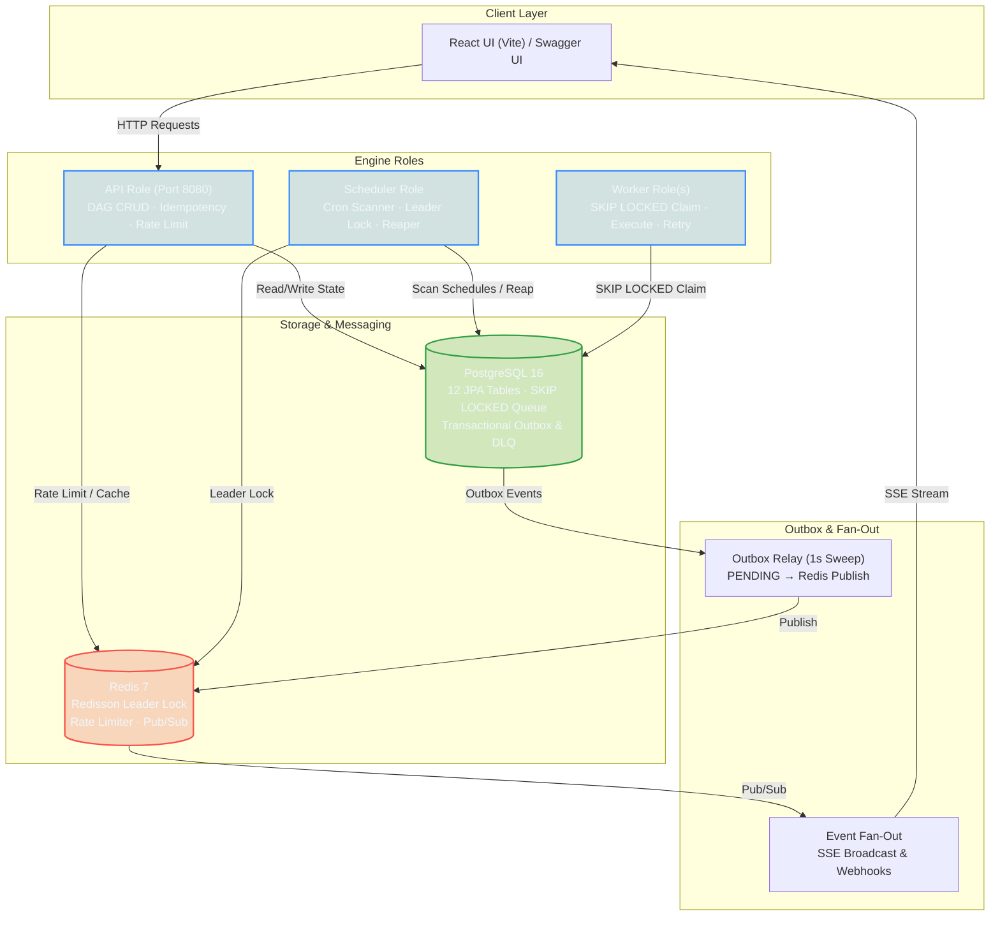

# Interactive Architecture Diagram Implementation Plan

> **For agentic workers:** REQUIRED SUB-SKILL: Use superpowers:subagent-driven-development (recommended) or superpowers:executing-plans to implement this plan task-by-task. Steps use checkbox (`- [ ]`) syntax for tracking.

**Goal:** Replace/enhance the static architecture ASCII diagram in `README.md` with a native GitHub Mermaid diagram with code deep links, an interactive SVG illustration, and a standalone interactive HTML architecture explorer.

**Architecture:** 
1. `docs/architecture.svg`: SVG vector diagram with embedded CSS hover animations, tooltips, and click links.
2. `docs/architecture.html`: Single-file HTML/CSS/JS web application providing an interactive component map, live data flow simulator, and task state machine explorer.
3. `README.md` & `docs/architecture.md`: Embedded SVG diagram image, GitHub-native Mermaid flowchart with clickable nodes, and links to the HTML visualizer.

**Tech Stack:** HTML5, CSS3, JavaScript (ES6), SVG, Mermaid.js, Markdown.

---

### Task 1: Create Interactive Vector SVG Diagram (`docs/architecture.svg`)

**Files:**
- Create: `docs/architecture.svg`

- [ ] **Step 1: Write `docs/architecture.svg`**

Create a clean, dark-mode SVG architecture diagram containing all core components (`api`, `scheduler`, `worker pool`, `PostgreSQL`, `Redis`, `Outbox relay`, `SSE`, `Webhooks`), with hover styling and links to source code:

```xml
<svg xmlns="http://www.w3.org/2000/svg" viewBox="0 0 1000 650" width="100%" height="100%" style="background-color: #0d1117; font-family: -apple-system, BlinkMacSystemFont, 'Segoe UI', Roboto, sans-serif;">
  <defs>
    <style>
      .title { font-size: 20px; font-weight: 700; fill: #58a6ff; }
      .subtitle { font-size: 12px; fill: #8b949e; }
      .box { fill: #161b22; stroke: #30363d; stroke-width: 1.5px; rx: 8px; transition: all 0.3s ease; }
      .box:hover { stroke: #58a6ff; fill: #1c2128; cursor: pointer; filter: drop-shadow(0 0 8px rgba(88, 166, 255, 0.4)); }
      .box-role { fill: #1f6feb; fill-opacity: 0.15; stroke: #388bfd; stroke-width: 1.5px; rx: 8px; }
      .box-role:hover { stroke: #58a6ff; fill-opacity: 0.25; cursor: pointer; filter: drop-shadow(0 0 10px rgba(56, 139, 253, 0.5)); }
      .box-db { fill: #238636; fill-opacity: 0.15; stroke: #2ea043; stroke-width: 1.5px; rx: 8px; }
      .box-db:hover { stroke: #3fb950; fill-opacity: 0.25; cursor: pointer; filter: drop-shadow(0 0 10px rgba(46, 160, 67, 0.5)); }
      .box-redis { fill: #da3633; fill-opacity: 0.15; stroke: #f85149; stroke-width: 1.5px; rx: 8px; }
      .box-redis:hover { stroke: #ff7b72; fill-opacity: 0.25; cursor: pointer; filter: drop-shadow(0 0 10px rgba(248, 81, 73, 0.5)); }
      .node-title { font-size: 14px; font-weight: 600; fill: #f0f6fc; }
      .node-desc { font-size: 11px; fill: #8b949e; }
      .badge { font-size: 10px; font-weight: 600; fill: #7ee787; }
      .edge { stroke: #484f58; stroke-width: 2px; fill: none; stroke-dasharray: 6; animation: dash 20s linear infinite; }
      .edge-active { stroke: #58a6ff; stroke-width: 2px; fill: none; }
      @keyframes dash { to { stroke-dashoffset: -100; } }
      .tooltip-text { font-size: 11px; fill: #c9d1d9; }
    </style>
    <marker id="arrow" viewBox="0 0 10 10" refX="6" refY="5" markerWidth="6" markerHeight="6" orient="auto-start-reverse">
      <path d="M 0 0 L 10 5 L 0 10 z" fill="#58a6ff"/>
    </marker>
  </defs>

  <!-- Title -->
  <text x="30" y="40" class="title">Workflow Orchestrator Architecture</text>
  <text x="30" y="60" class="subtitle">Distributed Engine Topology (Spring Boot 4.1 · Java 21 · PostgreSQL 16 · Redis 7)</text>

  <!-- Flow Lines -->
  <path d="M 180 150 L 260 150" class="edge-active" marker-end="url(#arrow)"/>
  <path d="M 460 150 L 540 150" class="edge-active" marker-end="url(#arrow)"/>
  <path d="M 360 200 L 360 280" class="edge-active" marker-end="url(#arrow)"/>
  <path d="M 360 380 L 360 450" class="edge-active" marker-end="url(#arrow)"/>
  <path d="M 540 490 L 460 490" class="edge-active" marker-end="url(#arrow)"/>
  <path d="M 690 200 L 690 450" class="edge-active" marker-end="url(#arrow)"/>
  <path d="M 690 490 L 770 490" class="edge-active" marker-end="url(#arrow)"/>

  <!-- React UI / Client -->
  <a href="https://github.com/gitanshulbisht/workflow-orchestrator/tree/main/frontend" target="_blank">
    <g transform="translate(30, 110)">
      <rect width="150" height="80" class="box"/>
      <text x="15" y="32" class="node-title">React UI / Client</text>
      <text x="15" y="52" class="node-desc">Vite + TS Dashboard</text>
      <text x="15" y="68" class="badge">Port 5173 / HTTP</text>
    </g>
  </a>

  <!-- API Role -->
  <a href="https://github.com/gitanshulbisht/workflow-orchestrator/tree/main/backend/src/main/java/com/buildathon/orchestrator/api" target="_blank">
    <g transform="translate(260, 100)">
      <rect width="200" height="100" class="box-role"/>
      <text x="15" y="30" class="node-title">API Role</text>
      <text x="15" y="48" class="node-desc">DAG CRUD &amp; Run Triggers</text>
      <text x="15" y="64" class="node-desc">Idempotency &amp; Rate Limit</text>
      <text x="15" y="82" class="badge">ROLES=api (Port 8080)</text>
    </g>
  </a>

  <!-- Outbox Relay -->
  <a href="https://github.com/gitanshulbisht/workflow-orchestrator/tree/main/backend/src/main/java/com/buildathon/orchestrator/outbox" target="_blank">
    <g transform="translate(540, 100)">
      <rect width="180" height="100" class="box"/>
      <text x="15" y="30" class="node-title">Outbox Relay</text>
      <text x="15" y="48" class="node-desc">1s Polling Sweep</text>
      <text x="15" y="64" class="node-desc">PENDING → PUBLISHED</text>
      <text x="15" y="82" class="badge">Transactional Outbox</text>
    </g>
  </a>

  <!-- Scheduler Role -->
  <a href="https://github.com/gitanshulbisht/workflow-orchestrator/tree/main/backend/src/main/java/com/buildathon/orchestrator/scheduling" target="_blank">
    <g transform="translate(770, 100)">
      <rect width="200" height="100" class="box-role"/>
      <text x="15" y="30" class="node-title">Scheduler Role</text>
      <text x="15" y="48" class="node-desc">Cron Scanner (2s tick)</text>
      <text x="15" y="64" class="node-desc">Leader Election &amp; Reaper</text>
      <text x="15" y="82" class="badge">ROLES=scheduler</text>
    </g>
  </a>

  <!-- PostgreSQL -->
  <a href="https://github.com/gitanshulbisht/workflow-orchestrator/tree/main/backend/src/main/resources/db/migration" target="_blank">
    <g transform="translate(260, 280)">
      <rect width="200" height="100" class="box-db"/>
      <text x="15" y="30" class="node-title">PostgreSQL 16</text>
      <text x="15" y="48" class="node-desc">12 JPA Tables (Flyway)</text>
      <text x="15" y="64" class="node-desc">SKIP LOCKED Task Queue</text>
      <text x="15" y="82" class="badge">Transactional Source of Truth</text>
    </g>
  </a>

  <!-- Redis -->
  <a href="https://github.com/gitanshulbisht/workflow-orchestrator/tree/main/backend/src/main/java/com/buildathon/orchestrator/lock" target="_blank">
    <g transform="translate(540, 280)">
      <rect width="180" height="100" class="box-redis"/>
      <text x="15" y="30" class="node-title">Redis 7</text>
      <text x="15" y="48" class="node-desc">Redisson Leader Lock</text>
      <text x="15" y="64" class="node-desc">Rate Limiter &amp; Pub/Sub</text>
      <text x="15" y="82" class="badge">Distributed Locks &amp; Cache</text>
    </g>
  </a>

  <!-- Workers -->
  <a href="https://github.com/gitanshulbisht/workflow-orchestrator/tree/main/backend/src/main/java/com/buildathon/orchestrator/worker" target="_blank">
    <g transform="translate(260, 450)">
      <rect width="200" height="100" class="box-role"/>
      <text x="15" y="30" class="node-title">Worker Role(s)</text>
      <text x="15" y="48" class="node-desc">Claim + Execute + Retries</text>
      <text x="15" y="64" class="node-desc">Heartbeat Daemon Pool</text>
      <text x="15" y="82" class="badge">ROLES=worker (Bounded Pool)</text>
    </g>
  </a>

  <!-- Fan-Out & Events -->
  <a href="https://github.com/gitanshulbisht/workflow-orchestrator/tree/main/backend/src/main/java/com/buildathon/orchestrator/outbox" target="_blank">
    <g transform="translate(540, 450)">
      <rect width="180" height="100" class="box"/>
      <text x="15" y="30" class="node-title">Event Fan-Out</text>
      <text x="15" y="48" class="node-desc">SSE Stream to Browser</text>
      <text x="15" y="64" class="node-desc">HMAC Signed Webhooks</text>
      <text x="15" y="82" class="badge">Pub/Sub Fanout</text>
    </g>
  </a>
</svg>
```

- [ ] **Step 2: Commit**

```bash
git add docs/architecture.svg
git commit -m "docs: add interactive SVG architecture diagram"
```

---

### Task 2: Create Standalone Interactive HTML Architecture Explorer (`docs/architecture.html`)

**Files:**
- Create: `docs/architecture.html`

- [ ] **Step 1: Write `docs/architecture.html`**

Create an interactive single-file web app in `docs/architecture.html` containing:
1. Component map topology with clickable detail inspection panel.
2. Interactive Data Flow Simulator (`Trigger Run`, `Worker Claim`, `Task Retry`, `Leader Tick`).
3. Task & Run State Machine Visualizer.

```html
<!DOCTYPE html>
<html lang="en">
<head>
  <meta charset="UTF-8">
  <meta name="viewport" content="width=device-width, initial-scale=1.0">
  <title>Workflow Orchestrator — Interactive Architecture Explorer</title>
  <style>
    :root {
      --bg: #0d1117;
      --card-bg: #161b22;
      --border: #30363d;
      --text: #c9d1d9;
      --text-heading: #f0f6fc;
      --primary: #58a6ff;
      --accent-green: #3fb950;
      --accent-red: #f85149;
      --accent-purple: #d2a8ff;
      --accent-yellow: #d29922;
    }
    * { box-sizing: border-box; margin: 0; padding: 0; }
    body {
      background-color: var(--bg);
      color: var(--text);
      font-family: -apple-system, BlinkMacSystemFont, "Segoe UI", Roboto, Helvetica, Arial, sans-serif;
      line-height: 1.5;
      padding: 24px;
    }
    header {
      margin-bottom: 24px;
      border-bottom: 1px solid var(--border);
      padding-bottom: 16px;
    }
    h1 { color: var(--text-heading); font-size: 26px; margin-bottom: 8px; }
    p.subtitle { color: #8b949e; font-size: 14px; }
    
    .nav-tabs {
      display: flex;
      gap: 12px;
      margin-top: 16px;
    }
    .tab-btn {
      background: var(--card-bg);
      border: 1px solid var(--border);
      color: var(--text);
      padding: 8px 16px;
      border-radius: 6px;
      cursor: pointer;
      font-weight: 600;
      transition: all 0.2s;
    }
    .tab-btn.active, .tab-btn:hover {
      background: #1f6feb;
      color: #ffffff;
      border-color: #58a6ff;
    }

    .tab-content { display: none; margin-top: 20px; }
    .tab-content.active { display: block; }

    /* Layout Grid */
    .grid { display: grid; grid-template-columns: 2fr 1fr; gap: 20px; }

    /* Component Cards */
    .topology-container {
      background: var(--card-bg);
      border: 1px solid var(--border);
      border-radius: 8px;
      padding: 20px;
      position: relative;
      min-height: 480px;
    }

    .node {
      position: absolute;
      background: #21262d;
      border: 2px solid var(--border);
      border-radius: 8px;
      padding: 12px;
      width: 170px;
      cursor: pointer;
      transition: all 0.3s;
    }
    .node:hover, .node.selected {
      border-color: var(--primary);
      box-shadow: 0 0 12px rgba(88, 166, 255, 0.4);
      transform: translateY(-2px);
    }
    .node-title { font-weight: 700; color: var(--text-heading); font-size: 14px; }
    .node-role { font-size: 11px; color: var(--accent-purple); text-transform: uppercase; font-weight: 600; }

    /* Inspection Panel */
    .panel {
      background: var(--card-bg);
      border: 1px solid var(--border);
      border-radius: 8px;
      padding: 20px;
    }
    .panel h2 { color: var(--text-heading); font-size: 18px; margin-bottom: 12px; }
    .panel-badge {
      display: inline-block;
      background: rgba(88, 166, 255, 0.15);
      color: var(--primary);
      padding: 4px 8px;
      border-radius: 4px;
      font-size: 12px;
      font-weight: 600;
      margin-bottom: 12px;
    }
    .panel-section { margin-bottom: 16px; }
    .panel-section h4 { color: #8b949e; font-size: 12px; text-transform: uppercase; margin-bottom: 4px; }

    /* Controls */
    .controls { display: flex; gap: 10px; margin-bottom: 16px; flex-wrap: wrap; }
    .action-btn {
      background: #238636;
      color: #fff;
      border: none;
      padding: 8px 14px;
      border-radius: 6px;
      font-weight: 600;
      cursor: pointer;
    }
    .action-btn:hover { background: #2ea043; }

    /* Animation overlay */
    .pulse-dot {
      position: absolute;
      width: 12px;
      height: 12px;
      background: var(--primary);
      border-radius: 50%;
      box-shadow: 0 0 8px var(--primary);
      transition: all 1s linear;
      z-index: 10;
    }
  </style>
</head>
<body>
  <header>
    <h1>Workflow Orchestrator — Interactive Architecture Explorer</h1>
    <p class="subtitle">An Airflow-lite DAG engine (Spring Boot 4.1 · Java 21 · PostgreSQL 16 · Redis 7)</p>
    <div class="nav-tabs">
      <button class="tab-btn active" onclick="switchTab('topology')">System Topology</button>
      <button class="tab-btn" onclick="switchTab('simulator')">Flow Simulator</button>
      <button class="tab-btn" onclick="switchTab('statemachine')">State Machine</button>
    </div>
  </header>

  <!-- TAB 1: TOPOLOGY -->
  <div id="tab-topology" class="tab-content active">
    <div class="grid">
      <div class="topology-container" id="topology-map">
        <div class="node" style="top: 30px; left: 30px;" onclick="inspect('api')">
          <div class="node-role">API Layer</div>
          <div class="node-title">API Role</div>
          <p style="font-size: 11px; color: #8b949e;">Port 8080</p>
        </div>
        <div class="node" style="top: 30px; left: 240px;" onclick="inspect('scheduler')">
          <div class="node-role">Scheduler</div>
          <div class="node-title">Cron Scanner</div>
          <p style="font-size: 11px; color: #8b949e;">Leader Election</p>
        </div>
        <div class="node" style="top: 180px; left: 30px;" onclick="inspect('postgres')">
          <div class="node-role">Database</div>
          <div class="node-title">PostgreSQL 16</div>
          <p style="font-size: 11px; color: #8b949e;">SKIP LOCKED Queue</p>
        </div>
        <div class="node" style="top: 180px; left: 240px;" onclick="inspect('redis')">
          <div class="node-role">Cache &amp; Locks</div>
          <div class="node-title">Redis 7</div>
          <p style="font-size: 11px; color: #8b949e;">Redisson Locks</p>
        </div>
        <div class="node" style="top: 330px; left: 30px;" onclick="inspect('worker')">
          <div class="node-role">Execution Pool</div>
          <div class="node-title">Worker Role(s)</div>
          <p style="font-size: 11px; color: #8b949e;">Bounded Executor</p>
        </div>
        <div class="node" style="top: 330px; left: 240px;" onclick="inspect('outbox')">
          <div class="node-role">Event Stream</div>
          <div class="node-title">Outbox &amp; Fan-out</div>
          <p style="font-size: 11px; color: #8b949e;">SSE &amp; Webhooks</p>
        </div>
      </div>

      <div class="panel" id="inspect-panel">
        <h2 id="panel-title">Click a node to inspect</h2>
        <div id="panel-body">
          <p style="color: #8b949e;">Select any component in the topology map to view its responsibilities, DB tables, concurrency mechanisms, and code links.</p>
        </div>
      </div>
    </div>
  </div>

  <!-- TAB 2: SIMULATOR -->
  <div id="tab-simulator" class="tab-content">
    <div class="controls">
      <button class="action-btn" onclick="runSimulation('trigger')">1. Trigger Run (API → Outbox)</button>
      <button class="action-btn" onclick="runSimulation('claim')">2. Claim Task (Worker SKIP LOCKED)</button>
      <button class="action-btn" onclick="runSimulation('retry')">3. Task Retry (Exponential Backoff)</button>
    </div>
    <div class="topology-container" style="min-height: 400px; background: #010409;">
      <div id="sim-log" style="font-family: monospace; font-size: 13px; color: #7ee787; padding: 16px; background: #161b22; border-radius: 6px; border: 1px solid #30363d; height: 350px; overflow-y: auto;">
        > Simulation log ready. Click a scenario button above to start step-by-step animation...
      </div>
    </div>
  </div>

  <!-- TAB 3: STATE MACHINE -->
  <div id="tab-statemachine" class="tab-content">
    <div class="panel" style="max-width: 800px;">
      <h2>Task Lifecycle State Machine</h2>
      <p style="color: #8b949e; margin-bottom: 16px;">Pure state machine enforced by TaskStateMachine.java</p>
      <div style="background: #0d1117; padding: 20px; border-radius: 8px; border: 1px solid #30363d; font-family: monospace; font-size: 13px;">
        PENDING ──► SCHEDULED ──► RUNNING ──► SUCCESS<br>
        &nbsp;&nbsp;&nbsp;&nbsp;│&nbsp;&nbsp;&nbsp;&nbsp;&nbsp;&nbsp;&nbsp;&nbsp;&nbsp;&nbsp;&nbsp;&nbsp;│&nbsp;&nbsp;&nbsp;&nbsp;&nbsp;&nbsp;&nbsp;&nbsp;&nbsp;&nbsp;&nbsp;&nbsp;│<br>
        &nbsp;&nbsp;&nbsp;&nbsp;▼&nbsp;&nbsp;&nbsp;&nbsp;&nbsp;&nbsp;&nbsp;&nbsp;&nbsp;&nbsp;&nbsp;&nbsp;▼&nbsp;&nbsp;&nbsp;&nbsp;&nbsp;&nbsp;&nbsp;&nbsp;&nbsp;&nbsp;&nbsp;&nbsp;▼<br>
        SKIPPED&nbsp;&nbsp;&nbsp;&nbsp;&nbsp;&nbsp;CANCELLED&nbsp;&nbsp;&nbsp;&nbsp;&nbsp;FAILED ──► UP_FOR_RETRY ──► SCHEDULED<br>
        &nbsp;&nbsp;&nbsp;&nbsp;&nbsp;&nbsp;&nbsp;&nbsp;&nbsp;&nbsp;&nbsp;&nbsp;&nbsp;&nbsp;&nbsp;&nbsp;&nbsp;&nbsp;&nbsp;&nbsp;&nbsp;&nbsp;&nbsp;&nbsp;&nbsp;&nbsp;&nbsp;&nbsp;&nbsp;&nbsp;└──► DEAD_LETTERED ──► SCHEDULED (replay)
      </div>
    </div>
  </div>

  <script>
    const data = {
      api: {
        title: "API Role (Port 8080)",
        badge: "ROLES=api",
        desc: "Serves REST endpoints for DAG registration, manual run triggers, and queries. Enforces idempotency via request-hash checks and token-bucket rate limiting.",
        tables: ["dag", "dag_task", "dag_run", "task_instance", "idempotency_record"],
        guarantee: "API-level & DB-level unique idempotency keys prevent duplicate run execution.",
        link: "https://github.com/gitanshulbisht/workflow-orchestrator/tree/main/backend/src/main/java/com/buildathon/orchestrator/api"
      },
      scheduler: {
        title: "Scheduler Role",
        badge: "ROLES=scheduler",
        desc: "Leader-elected cron scanner (2s tick). Scans due schedules and reaps tasks with stale heartbeats (>30s).",
        tables: ["dag_schedule", "task_instance"],
        guarantee: "Redisson distributed tryLock ensures exactly one scheduler scans schedules across multiple instances.",
        link: "https://github.com/gitanshulbisht/workflow-orchestrator/tree/main/backend/src/main/java/com/buildathon/orchestrator/scheduling"
      },
      postgres: {
        title: "PostgreSQL 16 Engine",
        badge: "SKIP LOCKED Queue",
        desc: "Transactional source of truth housing 12 Flyway tables. Task queueing uses SELECT FOR UPDATE SKIP LOCKED for lock-free distributed worker claims.",
        tables: ["task_instance", "task_attempt", "outbox_event", "dead_letter"],
        guarantee: "Transactional atomicity between state changes and outbox event records.",
        link: "https://github.com/gitanshulbisht/workflow-orchestrator/tree/main/backend/src/main/resources/db/migration"
      },
      redis: {
        title: "Redis 7 Cluster",
        badge: "Distributed Locks & Pub/Sub",
        desc: "Handles Redisson RLock leader election, RRateLimiter token buckets, DAG definition caching, and pub/sub event broadcasting.",
        tables: ["In-memory Keyspace"],
        guarantee: "Zero-wait distributed mutex lock acquisitions.",
        link: "https://github.com/gitanshulbisht/workflow-orchestrator/tree/main/backend/src/main/java/com/buildathon/orchestrator/lock"
      },
      worker: {
        title: "Worker Role(s)",
        badge: "ROLES=worker",
        desc: "Polls ready tasks, claims via SKIP LOCKED, executes tasks outside DB transactions, and maintains continuous row heartbeats.",
        tables: ["task_instance", "task_attempt"],
        guarantee: "At-most-once execution per claimed task row with exponential backoff + jitter retries.",
        link: "https://github.com/gitanshulbisht/workflow-orchestrator/tree/main/backend/src/main/java/com/buildathon/orchestrator/worker"
      },
      outbox: {
        title: "Outbox Relay & Fan-Out",
        badge: "SSE + Webhooks",
        desc: "Polls PENDING outbox events every 1s, publishes to Redis pub/sub, and streams live events to React UI via SSE and HMAC webhooks.",
        tables: ["outbox_event", "webhook", "webhook_delivery"],
        guarantee: "At-least-once outbox event delivery without lost updates.",
        link: "https://github.com/gitanshulbisht/workflow-orchestrator/tree/main/backend/src/main/java/com/buildathon/orchestrator/outbox"
      }
    };

    function switchTab(name) {
      document.querySelectorAll('.tab-btn').forEach(b => b.classList.remove('active'));
      document.querySelectorAll('.tab-content').forEach(c => c.classList.remove('active'));
      event.target.classList.add('active');
      document.getElementById('tab-' + name).classList.add('active');
    }

    function inspect(key) {
      const item = data[key];
      if(!item) return;
      const html = `
        <span class="panel-badge">${item.badge}</span>
        <p style="margin-bottom: 12px; font-size: 13px;">${item.desc}</p>
        <div class="panel-section">
          <h4>Concurrency Guarantee</h4>
          <p style="font-size: 12px; color: #7ee787;">${item.guarantee}</p>
        </div>
        <div class="panel-section">
          <h4>Key Tables</h4>
          <p style="font-size: 12px; color: var(--accent-purple);">${item.tables.join(", ")}</p>
        </div>
        <a href="${item.link}" target="_blank" style="color: var(--primary); font-size: 12px; text-decoration: underline;">View Source Code →</a>
      `;
      document.getElementById('panel-title').innerText = item.title;
      document.getElementById('panel-body').innerHTML = html;
    }

    function runSimulation(type) {
      const log = document.getElementById('sim-log');
      if (type === 'trigger') {
        log.innerHTML += `<br>[${new Date().toLocaleTimeString()}] POST /api/v1/dags/1/runs received with Idempotency-Key.`;
        log.innerHTML += `<br>[${new Date().toLocaleTimeString()}] DB TX: Insert dag_run(PENDING), task_instance(SCHEDULED), outbox_event(DAG_RUN_CREATED).`;
        log.innerHTML += `<br>[${new Date().toLocaleTimeString()}] OutboxRelay sweep: PENDING -> Redis pub/sub channel 'orchestrator:events' -> SSE broadcast.`;
      } else if (type === 'claim') {
        log.innerHTML += `<br>[${new Date().toLocaleTimeString()}] Worker thread poll: SELECT * FROM task_instance WHERE state='SCHEDULED' FOR UPDATE SKIP LOCKED.`;
        log.innerHTML += `<br>[${new Date().toLocaleTimeString()}] Worker claims task 101 -> state=RUNNING, started_at=now(), heartbeat_at=now().`;
        log.innerHTML += `<br>[${new Date().toLocaleTimeString()}] Task execution running in background; heartbeat refresher active.`;
      } else if (type === 'retry') {
        log.innerHTML += `<br>[${new Date().toLocaleTimeString()}] Task 101 attempt 1 failed with exit code 1.`;
        log.innerHTML += `<br>[${new Date().toLocaleTimeString()}] BackoffCalculator: raw = 5.0 * 2.0^0 = 5s. Jitter delay = 3.2s.`;
        log.innerHTML += `<br>[${new Date().toLocaleTimeString()}] State updated: UP_FOR_RETRY -> scheduled_at = now() + 3.2s. Re-enters queue.`;
      }
      log.scrollTop = log.scrollHeight;
    }
  </script>
</body>
</html>
```

- [ ] **Step 2: Commit**

```bash
git add docs/architecture.html
git commit -m "docs: add standalone interactive architecture explorer HTML app"
```

---

### Task 3: Update `README.md` and `docs/architecture.md`

**Files:**
- Modify: `README.md:71-114`
- Modify: `docs/architecture.md:1-20`

- [ ] **Step 1: Update `README.md` Architecture Section**

Replace lines 78-114 of `README.md` with embedded SVG illustration, GitHub-native Mermaid.js diagram with clickable source links, and link to `docs/architecture.html`.

```markdown
## Architecture

One Maven artifact runs as three logical roles selected by the `ROLES` env var
(`api`, `scheduler`, `worker`). `docker-compose.yml` runs them as separate processes;
a single Render instance runs all three (safe: `SKIP LOCKED` claims and Redisson locks
make colocation race-free).

[](docs/architecture.html)

> 💡 **[Open Interactive Architecture Explorer](docs/architecture.html)** — Explore live component topology, simulated task execution flow, and state machine transitions in your browser!


```

- [ ] **Step 2: Update `docs/architecture.md` Header**

Add links to `docs/architecture.svg` and `docs/architecture.html` at the top of `docs/architecture.md`.

```markdown
# Architecture

> 🌐 **[Interactive Architecture Explorer App](architecture.html)** | 🎨 **[High-Res Vector Diagram SVG](architecture.svg)**
```

- [ ] **Step 3: Commit**

```bash
git add README.md docs/architecture.md
git commit -m "docs: integrate interactive SVG and Mermaid architecture diagrams into README"
```

---

### Task 4: Verification & Manual Link Validation

- [ ] **Step 1: Check git diff and files exist**

```bash
ls -l docs/architecture.svg docs/architecture.html
git status
```
Expected output: clean git status or changes committed cleanly.

- [ ] **Step 2: Final Commit check**

```bash
git log -n 4 --oneline
```
Expected output: commits for Task 1, 2, and 3 present.
